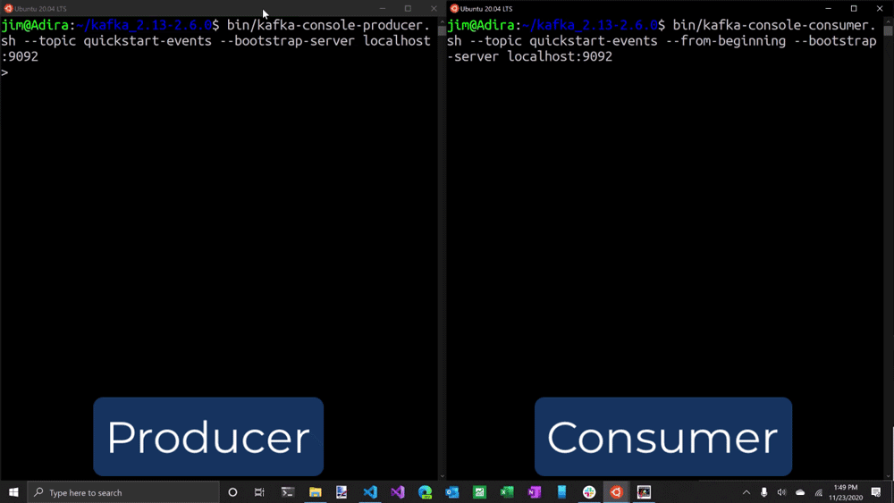

# Run Apache Kafka
## Start the Kafka cluster
Change into the Kafka directory depending on your installation/version and start ZooKeeper:
```bash
cd kafka_2.12-2.6.0
bin/zookeeper-server-start.sh config/zookeeper.properties
```
There will be a lot of output, and ZooKeeper will be ready in a short time, typically around a second or two.

Open another terminal session. Change the directory to the kafka directory, and start the Kafka broker:
```bash
cd kafka_2.12-2.6.0
bin/kafka-server-start.sh config/server.properties
```

If you arrange the windows to be side by side, your output should resemble the following screenshot:


## Produce and consume some messages
Open another terminal session and run the ``kafka-topics`` command to create a Kafka topic named **quickstart-events**:
```bash
cd kafka_2.13-2.6.0
bin/kafka-topics.sh --create --topic quickstart-events --bootstrap-server localhost:9092
```

Open two more terminals, in on terminal run the Producer and in the other run the Consunmer of the topic named **quickstart-events**:  
```bash
cd kafka_2.13-2.6.0
bin/kafka-console-producer.sh --create --topic quickstart-events --bootstrap-server localhost:9092
```
```bash
cd kafka_2.13-2.6.0
bin/kafka-console-consumer.sh --create --topic quickstart-events --bootstrap-server localhost:9092
```

Arrange the producer and consumer terminal windows to be side by side. In the producer terminal, type a few more messages, and watch as they appear in the consumer terminal.


## Stop Kafka
When you’re done experimenting with Kafka, follow these steps to exit the Kafka environment:

1. Stop the consumer and producer clients with Ctrl+C
2. Stop the Kafka broker with Ctrl+C
3. Stop the ZooKeeper server with Ctrl+C
4. Run the following command to clean up:
```bash
rm -rf /tmp/kafka-logs /tmp/zookeeper
```
