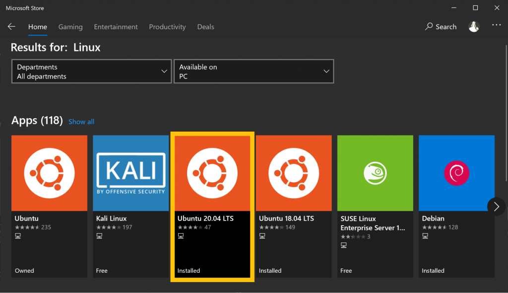
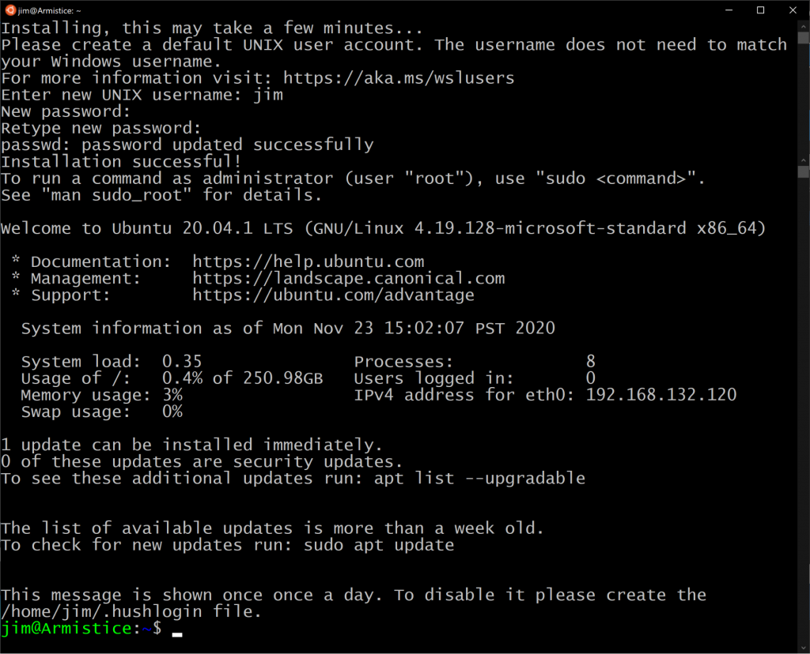

# Apache Kafka Workshop

## Set up environment
### Install WSL
#### Enable the Windows Subsystem for Linux
Turn on the Windows Subsystem for Linux feature before installing a Linux distribution. Open PowerShell as an administrator, and run the following command:
```powershell
dism.exe /online /enable-feature /featurename:Microsoft-Windows-Subsystem-Linux /all /norestart
```
This may take a minute or two. Your output should resemble the following:
```powershell
Deployment Image Servicing and Management tool
Version: 10.0.18362.1139

Image Version: 10.0.18363.1139

Enabling feature(s)
[==========================100.0%==========================]
The operation completed successfully.
```

#### Enable the Virtual Machine feature
WSL 2 requires the Virtual Machine Platform feature. In PowerShell, run the following command:
```powershell
dism.exe /online /enable-feature /featurename:VirtualMachinePlatform /all /norestart
```

#### Get the Linux kernel update
[Download the Linux kernel update package](https://wslstorestorage.blob.core.windows.net/wslblob/wsl_update_x64.msi), which is a regular Windows Installer (.msi) file.
Double-click the .msi file to install the WSL 2 update. If you’re prompted for elevated permissions, select Yes to approve the installation.

#### Set the default WSL version
In PowerShell, run the following command to set WSL 2 as the default version for your Linux distributions:
```powershell
wsl --set-default-version 2
```
Your output should resemble the following:
```powershell
For information on key differences with WSL 2 please visit https://aka.ms/wsl2
```
:congratulations: WSL 2 is ready to use. For more information on installing WSL 2, including troubleshooting, see Windows Subsystem for Linux Installation Guide for Windows 10.


### Install your preferred Linux distribution
Install Linux from the Microsoft Store, the same way you install other applications on Windows. 
Open the Microsoft Store app and search for “Linux.”



Select **Ubuntu 20.04** LTS and click **Install**.

When the installation is complete, click **Launch**. The shell opens and displays the following message:
```powershell
Installing, this may take a few minutes...
Please create a default UNIX user account. The username does not need to match your Windows username.
For more information visit: https://aka.ms/wslusers
Enter new UNIX username:
```
Enter a username and password to complete the installation.



### Install Java
Run the package manager to get the latest updates. In the Ubuntu shell window that opened above, run the following commands:
```bash
sudo apt-get update && sudo apt-get upgrade -y
```

> :information_source: Tip: Right-click pastes text into the terminal window.

Kafka requires the Java runtime to be version 8 or higher. Check the Java version in your Linux installation:
```bash
java -version
```

Your output should resemble this:
```bash
openjdk version "1.8.0_265"
OpenJDK Runtime Environment (build 1.8.0_265-8u265-b01-0ubuntu2~20.04-b01)
OpenJDK 64-Bit Server VM (build 25.265-b01, mixed mode)
```

If Java isn’t installed (likely) or it’s not the right version, install it by using your distribution’s package manager. There are a lot of ways to install Java. On Ubuntu, this is one of the simplest:
```bash
sudo apt install openjdk-8-jdk -y
```

### Download Kafka
You can install Kafka by using a package manager, or you can download the tarball and extract it to your local machine directly.
Execute the following command to download Kafka 3.0:
```bash
wget https://dlcdn.apache.org/kafka/3.0.0/kafka_2.13-3.0.0.tgz
```

Run the following commands to untar the Kafka archive, and cd to the kafka directory:
```bash
tar -xzf kafka_2.13-3.0.0.tgz
cd kafka_2.13-3.0.0
```

Run the `ls -al` command to list the contents of the kafka directory:
```bash
total 64
drwxr-xr-x  7 jim jim  4096 Oct 14 12:27 ./
drwxr-xr-x 25 jim jim  4096 Nov 20 12:52 ../
-rw-r--r--  1 jim jim 29975 Jul 28 11:16 LICENSE
-rw-r--r--  1 jim jim   337 Jul 28 11:16 NOTICE
drwxr-xr-x  3 jim jim  4096 Jul 28 11:23 bin/
drwxr-xr-x  2 jim jim  4096 Jul 28 11:23 config/
drwxr-xr-x  2 jim jim  4096 Oct 14 12:26 libs/
drwxr-xr-x  2 jim jim  4096 Oct 14 12:28 logs/
drwxr-xr-x  2 jim jim  4096 Jul 28 11:23 site-docs/
```
